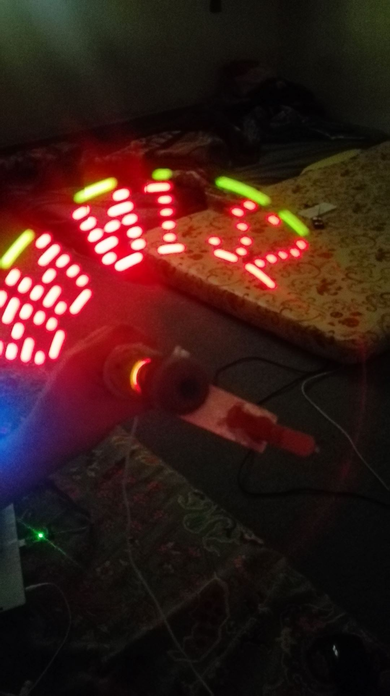

# Propeller Display (8051 uC Based)

## Table of Contents
- [Introduction](#introduction)
- [Picture Demos](#picture-demos)
- [Video Demos](#video-demos)
- [Algorithm](#algorithm)
- [Code Coposition](#code-coposition)
- [Hardware Build Snaps](#hardware-build-snaps)


## Introduction


This repo hosts the C-codes and relevent helpful materials fro `Propeller Display` project based on a very old and basic Micro-controller `8051`. I did this as my mini project for the course of Micro-pocesser and Micro-controller course in 4th (2018) semester of my BS Electrical Engineering from University of Engineering and Technology (UET) Peshawar, Pakistan. The working principle of this display is based on persistant of vision.

## Picture Demos

Some Alphabets


`Single Clock` in `HH:MM:SS` format.

The time is `00:01:32`



Now the time is changed to `00:01:34`


`2 Clocks` in `HH:MM:SS` format.

Time is `00:02:32`


Now the time is changed to `00:02:39`


## Video Demos

Videos of the project can be found in the play lsit [8051 based PROPELLER DISPLAY](https://youtube.com/playlist?list=PLNBn_qYJ3AlEmv02dY1OdYrDOFQ7hLRQc&si=kuLut_BJZ7pDQ_ap) of my youtube cahnnel.

## Algorithm 
			
- `STEP 1`: Measure Time per Revolution.
- `STEP 2`: Calculates Time Per Pixel. (Pixel Means a Single Column of LEDs).
- `STEP 3`: Calculates Delay per Pixel. (Time for which a pixel will be on)
- `STEP 4`: Outputs the Respective Code For a respective Graphics (Character).
- `STEP 5`: Calls Delay per Pixel.
- `STEP 6`: Repeats STEP 4 & STEP 5 ,Untill all the codes are outputed for a respective Character.
- `STEP 7`: Repeats STEP 4 to STEP 6 ,Untill all the characters are Displayed.				
- `Step 8`: Repeat STEP 1 to STEP 8: 

## Code Coposition
The `C-Codes (8051 uC) ` folder contains 5 important files, the,

- `CHARACTER.h`

    This file holds the led patterens for A-Z and a-z characters.

- `DISPLAYY.h`

    This file contains the inturrupt and    timer rotines and other functions to display characters on the leds, while its rotating.

- `INITIALIZESYSTEM.h`

    This file  contains the micro-controller timers, IOs, intrrupts and Other initialization codes.

- `SERIALRECIVE.h`

    This file is for reciving display strings via bluetooth but this was not implimented.
        
 and

- `PROPELLER DISPLAY PROJECT.c`

    This is main `C` file, which displays the messages on display. To display your string just write your message in the following function.

    ```C
	display("Your Message");		//MAXIMUM 18 CHARACTERS
    ```
    For example if I want to dispay the message 

    `PROPELLER DISPLAY MADE BY DURRENAJAF ASHFAQ AHMAD AND MUHAMMAD QAISAR ALI SUBMITTED TO SIR GUL MUHAMMAD AND SIR NASAR JAMAL THANK YOU`. 

    I will split the massage the follwing way.
    ```C
    display("PROPELLER DISPLAY");	
    display("MADE BY");	
    display("DURRENAJAF");
    display("ASHFAQ AHMAD");
    display("M QAISAR ALI");
    display("M QAISAR ALI");	
    display("SUBMITTED TO");	
    display("SIR GUL MUHAMMAD");
    display("AND");		
    display("SIR NASAR JAMAL");
    display("THANK YOU");		
    ```
    This way you can display a whole story.


## Hardware Build Snaps

LEDs and LED Drivers are soldered on vero board 


Wires are now soldered.


Initial Testing


